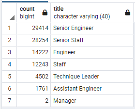

# Pewlett-Hackard-Analysis

## Overview
Pewlett Hackard is a large company that needs to look ahead to understand who will be retiring soon and how many positions will need to be filled. The purpose of this report is to determine the number of retiring employees per title, and identify employees who are eligible to participate in a mentorship program.

## Results

## Summary

