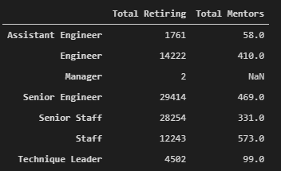
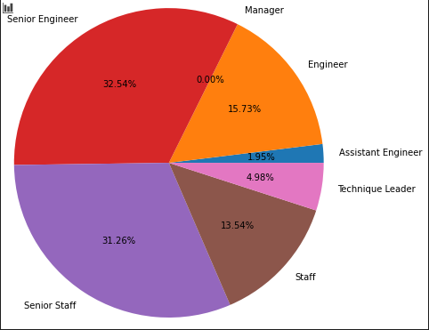

# Pewlett-Hackard-Analysis

## Overview
Pewlett Hackard is a large company that needs to look ahead to understand who will be retiring soon and how many positions will need to be filled. The purpose of this report is to determine the number of retiring employees per title, and identify employees who are eligible to participate in a mentorship program.

## Results

The following chart shows the amount of people eligible for retirement packages by title. The senior engineers make up the most of this dataset, followed closely by senior staff. 

This dataframe shows the amount of people retiring compared next to the amount of people elibible for the mentorship program. This shows that there are many fewer employees ready to be mentors than there are people ready to retire. 

This pie chart shows the percent of each type of employee that will need to be hired soon. Nearly two thirds of the employees retiring are either senior engineers or senior staff. 

In order to understand where the greatest need is for mentorship, the analyst compared the amount of people retiring with the amount of mentors that will be available. This graph shows that even though there will need to be more senior engineers hired, senior staff needs more help with mentorship, as there would be close to 85 new senior staff members per every available mentor.

## Summary

The summary addresses the following two questions:

- How many roles will need to be filled as the "silver tsunami" begins to make an impact?
  -- In total, 90,398 roles will need to be filled. To see this broken down by title, please see the first graphic in the *Results* portion of this analysis.
  
- Are there enough qualified, retirement-ready employees in the departments to mentor the next generation of Pewlett Hackard employees?
  -- At this point, it would be very difficult to successfully mentor the next generation of employees based on the current criteria for the mentorship program. Senior staff mentors would need to mentor about 85 people each, which is way too many to be successful. Even staff mentors would need to mentor around 20 new employees each. Based on this analysis, it might be best to promote staff members to senior staff, who would need less mentorship. Then, hire new staff.
